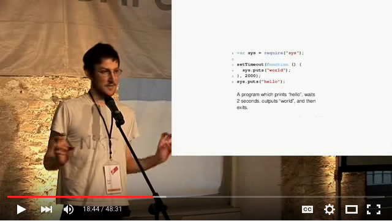

# node-playground

## Ryan Dahl: Original Node.js presentation (2009)

[](https://www.youtube.com/watch?v=ztspvPYybIY&t=18m40s)

```javascript
var sys = require("sys");

setTimeout(function () {
  sys.puts("world");
}, 2000);
sys.puts("hello");
```

```shell
$ node hello.js 
(node) sys is deprecated. Use util instead.
(node) util.puts is deprecated. Use console.log instead.
hello
world
```
